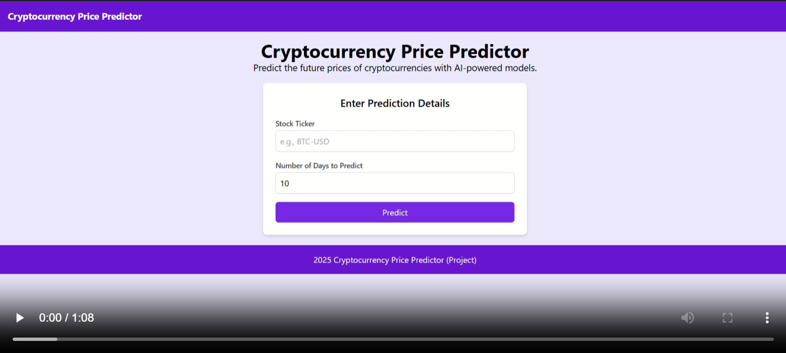

# Cryptocurrency Predictor

An AI-powered Flask web application that predicts cryptocurrency prices using historical data and deep learning models. Users can input a cryptocurrency ticker symbol and specify the number of future days for prediction.
> **Disclaimer:**  
> The predictions generated by this application are for educational and informational purposes only. They are not real, reliable, or accurate for financial decision-making. **Do not use these predictions to make investment decisions or risk your money.** The authors of this project are not responsible for any financial losses incurred by using this application.

## Features
- **Historical Data Fetching:** Retrieves cryptocurrency data from Yahoo Finance.
- **Price Prediction:** Predicts future prices using a pre-trained Keras model.
- **Visualizations:** Generates plots for:
  - Historical closing prices.
  - Original vs predicted test data.
  - Future price predictions.
- **Interactive UI:** User-friendly interface built with Bootstrap.

## Technologies Used
- **Backend:**
  - Flask
  - TensorFlow/Keras
  - Yahoo Finance API (`yfinance`)
  - Pandas, NumPy
- **Frontend:**
  - HTML, CSS (via Bootstrap)
  - JavaScript for interactivity
- **Visualization:**
  - Matplotlib
- **Preprocessing:**
  - Scikit-learn (MinMaxScaler)

## Preview

## Usage
1. Enter the cryptocurrency ticker symbol (e.g., `BTC-USD`).
2. Specify the number of future days to predict.
3. Click "Predict."
4. View the results, including plots and predicted prices.
